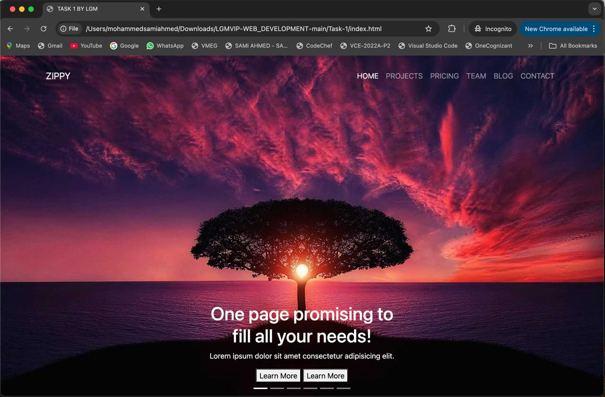

# LGMVIP-WEB_DEVELOPMENT

# Task-1: Zippy Web Application

This is a **single-page website** created as part of the _LGM Task 1_ that uses **HTML, CSS, Bootstrap**, and **JavaScript**. It is designed to be a responsive and interactive website with a focus on projects, pricing, and team sections. The website also features carousels for video projects and team images, as well as a sticky navigation bar that adapts upon scrolling.

## Features

1. **Responsive Navbar**: A navigation bar that dynamically changes between fixed and static based on scroll position.
2. **Carousel Sliders**: Two carousels implemented using Owl Carousel:
   - Video Project carousel.
   - Team Images carousel.
3. **Project Display**: Cards for displaying projects with descriptions and buttons.
4. **Pricing Section**: Three pricing tiers with a button to "Buy".
5. **Contact Section**: A form for users to reach out via email.
6. **Interactive Image Change**: Clicking on team thumbnails updates the main image.
7. **Newsletter Signup**: A form for users to sign up for the newsletter.
8. **Google Maps Integration**: Embedding of Google Maps to show the location.

## Technologies Used

- **HTML5**: Markup language for the webpage structure.
- **CSS3 & Bootstrap 4**: For styling and responsive layouts.
- **JavaScript (JQuery)**: For dynamic behaviors such as the carousels and scroll-based navbar behavior.
- **Owl Carousel**: For implementing carousels in the video and team sections.

## Code Overview

### HTML

- The main structure includes multiple sections such as the home page, projects, pricing, videos, and team.
- The header section includes a navigation bar with links to different sections of the page.
- Images and videos are integrated into various sections using `` and `<video>` tags.

### CSS

- The project uses Bootstrap 4 for a responsive design and layout. It also integrates custom styles for icons, buttons, and spacing.
- Font Awesome is used for icons throughout the site.

### JavaScript

The project includes custom scripts written in `index.js`:
- **Sticky Navbar**: The navbar changes between `fixed-top` and normal based on the scroll position.
- **Owl Carousel**: Two carousels are set up for the Video Projects and Life in Zippy sections.
- **Dynamic Image Display**: The `changePic()` function changes the displayed team image when a thumbnail is clicked.

## Installation

To use this project locally:

1. Clone the repository:
   ```bash
   git clone https://github.com/SamiAhmed007/LGMVIP-WEB_DEVELOPMENT/Task-1.git
2. Open the index.html file in your browser.

## Dependencies
This project relies on the following CDN libraries:

- Bootstrap (v4.6.0)
- Font Awesome (v5.1.0)
- Owl Carousel (v2.3.4)

## Usage
- Scroll down to explore the different sections such as Projects, Pricing, and Team.
- Click on a team member's image to see it displayed in the main image viewer.
- Use the Newsletter form to submit your email.

## Output:



# Task 2: User Information Display Web App

This project is a simple web application that fetches user information from an API and displays it dynamically on the webpage. The layout includes user avatars, names, and emails, all retrieved from the **Reqres.in** API.

## Features

- Fetches data from [Reqres API](https://reqres.in/) and displays user details.
- Displays user avatars, full names, and emails in a grid format.
- Stylish and responsive UI with hover effects for table rows.

## Technologies Used

- **HTML**: For structuring the content of the web page.
- **CSS**: For styling the elements and making the UI visually appealing.
- **JavaScript**: For fetching data from the API and dynamically updating the webpage.
- **API**: [Reqres.in API](https://reqres.in/) for user data.

## Project Structure

- **index.html**: The main HTML page which contains the structure of the webpage, including the table layout for user data.
- **styles.css**: The stylesheet that styles the webpage, providing layout properties, color themes, and hover effects.
- **api.js**: Contains the JavaScript logic to fetch data from the API and dynamically update the DOM with user avatars, names, and emails.

## How It Works

1. The web page initially displays a button labeled **"GET USER"**.
2. Clicking the button triggers the `getData()` function from the **api.js** file.
3. The function makes a request to the **Reqres.in** API to fetch user data.
4. The user information (avatars, names, and emails) is then displayed in a grid format inside a table.

## Instructions to Run

1. Clone the repository:
   ```bash
   git clone https://github.com/SamiAhmed007/LGMVIP-WEB_DEVELOPMENT/Task-2.git
2. Open the index.html file in your browser to view the application.

## Example Output
Once the button is clicked, you will see a grid with the following:

- User Avatars: Displayed from the API.
- Full Names: First and last names are displayed.
- Emails: User emails are shown below the names.
  


## Contributing
Feel free to open a pull request if you'd like to contribute to this project.
